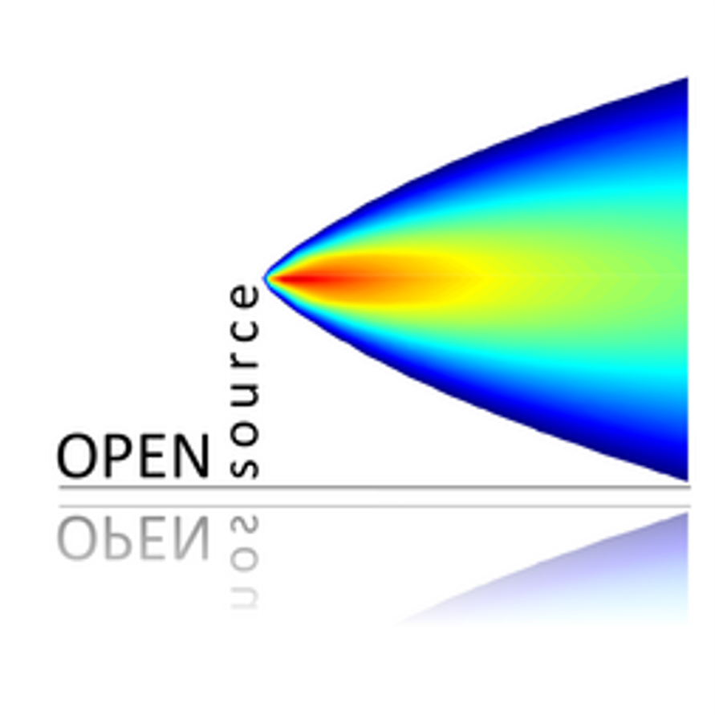

# The Openair Project: Open Source Tools for Air Quality Data Analysis 

The openair toolkit is a family of [R](https://www.r-project.org/) packages developed for the purpose of analysing air quality data — or more generally atmospheric composition data. The packages are extensively used in academia and the public and private sectors. The project was initially funded by the [UK Natural Environment Research Council (NERC)](https://www.ukri.org/councils/nerc/), with additional funds from the [UK Department for Environment Food & Rural Affairs (Defra)](https://www.gov.uk/government/organisations/department-for-environment-food-rural-affairs).

**Learn more in the [openair book 📖](https://openair-project.github.io/book/).**
